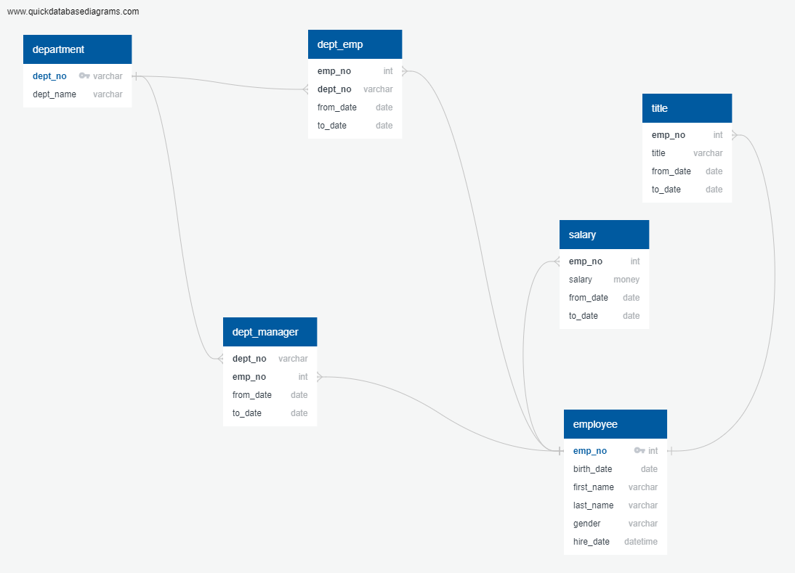

# Migration and Analysis of Enterprise-level Employee Data

## Project Description

Database construction and subsequent analysis for a software company that had been managing employee information using only CSVs **more context here**.

Data was migrated into a PostgreSQL database based on a model constructed as part of this exercise.

This analaysis requires two deliverables based on the processed data:
* A count of employees eligible for requirement based on their title
* The number of employees eligible for mentorship programs.

## Resources

* PostgreSQL 11
* pgAdmin 4.6.1
* Visual Studio Code (1.63.2)
* [quickdatabasediagrams.com](http://www.quickdatabasediagrams.com)

## The Data

### Input files

* `employees.csv` - Personal information of each employee **past and present**?
* `departments.csv` - List of each company department.
* `titles.csv` - All titles held by an employee for their entire tenure.
* `salaries.csv` - All salaries earned by each employee for their entire tenure.
* `dept_emp.csv` - List of all allocated 
* `dept_manager.csv` - Full historical dataset of managers for each department.

### Output files

* `Data/retirement_titles.csv` - Contains the full list of all employees born in this window along with every title they have held during their tenure.  
* `Data/unique_titles.csv` - Contains the list from the above, but reduced to one entry per employee, containing their current title.
* `Data/retiring_titles.csv` - The final results, containing the values from `unique_titles.csv`, counted by specific title. 
* `Data/mentorship_eligibility.sql` - List of all employees eligible for the mentorship program.

### Transformation

Generated data model based on the source files listed below in Figure 1.  Results migrated into a PostgreSQL database.

Data schema was created based on this model and schema creation scripts are retained in `Queries/Schema.sql`.

## Analysis

Queries are listed in the file `Queries/Employee_Database_challenge.sql`

### Retirement-eligible employees by title

Employees are listed as eligible to retire based on their year of birth, which is between 1952 and 1955.  

Final results

| Count | Title |
| ----- | ----- |
| 29414	| Senior Engineer |
| 28254	| Senior Staff |
| 14222	| Engineer |
| 12243	| Staff |
| 4502 | Technique Leader |
| 1761 | Assistant Engineer |
| 2	| Manager |

### Employees entering a mentorship program

Oddly, the mentorship program is only available to employees born in the year 1965, for a total of **1,549** eligible employees.